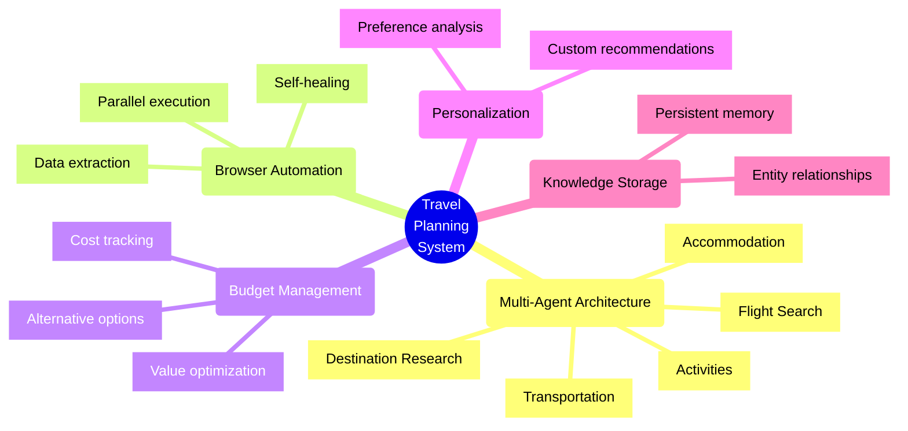
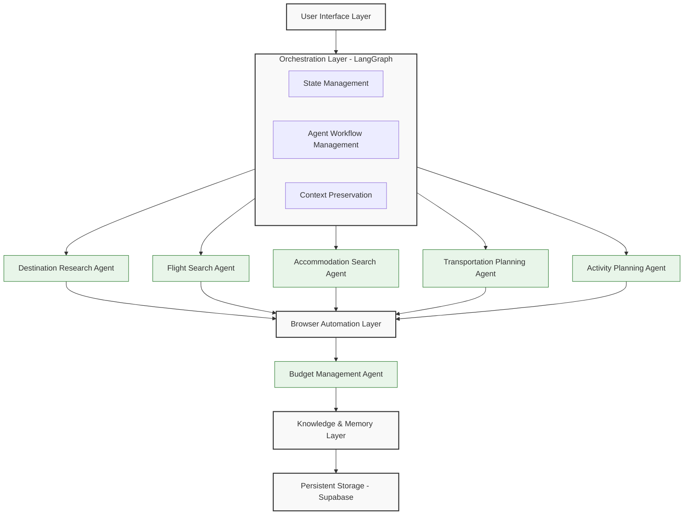
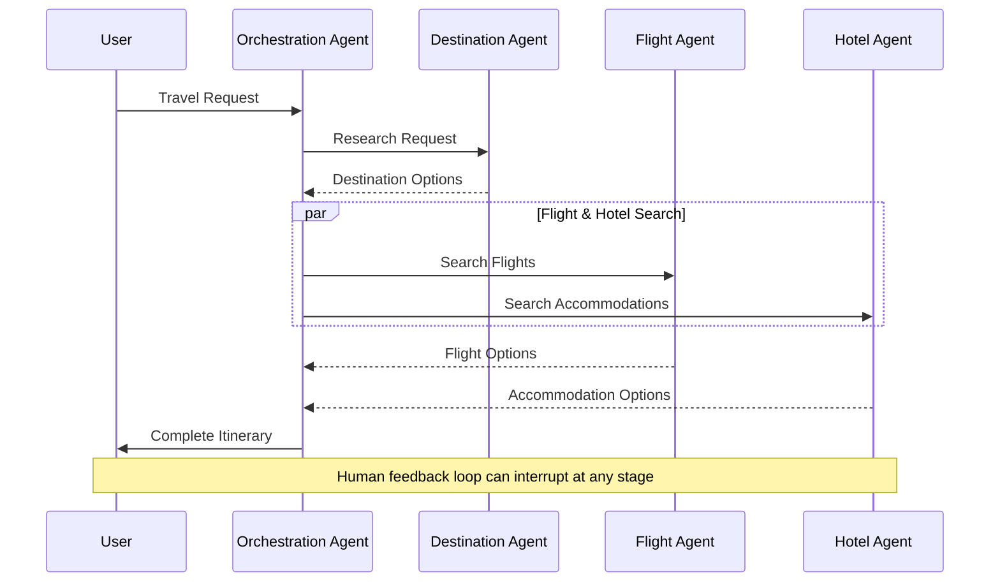

# OpenAI Agents Travel Graph 🧳 ✈️ 🗺️

A state-of-the-art multi-agent travel planning system powered by OpenAI Agents SDK and LangGraph orchestration. This system autonomously researches and plans comprehensive trips with optimized budgets, personalized recommendations, and real-time data through intelligent browser automation.

## Table of Contents

- [OpenAI Agents Travel Graph 🧳 ✈️ 🗺️](#openai-agents-travel-graph--️-️)
  - [Table of Contents](#table-of-contents)
  - [Overview](#overview)
  - [Key Features](#key-features)
  - [Technology Stack](#technology-stack)
  - [System Architecture](#system-architecture)
  - [Installation](#installation)
  - [Usage](#usage)
  - [Development](#development)
  - [Contributing](#contributing)
  - [License](#license)
  - [How to Cite](#how-to-cite)

## Overview

OpenAI Agents Travel Graph is an advanced AI-powered travel planning system that leverages the latest in multi-agent technology to automate the entire travel planning process. The system orchestrates specialized agents to handle different aspects of travel planning, from destination research and flight bookings to accommodation selection and activity planning.

By combining the power of the OpenAI Agents SDK with graph-based orchestration through LangGraph, the system can maintain complex workflows while providing personalized travel recommendations that meet user preferences and budget constraints.

## Key Features



- 🤖 **Multi-Agent Architecture** - Specialized agents for different travel planning aspects
- 💰 **Budget Optimization** - Intelligent allocation of budget across travel components
- 🔍 **Real-time Research** - Autonomous web research for current travel information
- 🌐 **Browser Automation** - Intelligent interaction with travel websites
- 📋 **Detailed Itineraries** - Day-by-day schedules with activities and logistics
- 💼 **Personalization** - Tailored recommendations based on user preferences
- 🔄 **Alternative Suggestions** - Multiple options with comparisons
- 📊 **Budget Breakdowns** - Transparent cost allocation and justification

## Technology Stack

- **Primary Framework**: [OpenAI Agents SDK](https://github.com/openai/openai-agents-python) (Latest 2025 Release) - Core agent framework
- **Orchestration**: [LangGraph v0.4+](https://github.com/langchain-ai/langgraph) - Multi-agent workflow management
- **Browser Automation**: [Stagehand v2.0+](https://github.com/browserbase/stagehand) - AI-enhanced browser control
- **Data Persistence**: [Supabase](https://supabase.com/) - Database and storage
- **Research Tools**:
  - [Firecrawl](https://firecrawl.dev/) - Web content extraction
  - [Tavily API](https://tavily.com/) - Intelligent search
  - [Context7](https://context7.com/) - Documentation access
- **Memory Management**: Memory MCP Server - Persistent context across sessions

For the full technology stack and detailed system architecture, see [Architecture & Requirements](docs/architecture-requirements.md).

## System Architecture

The system follows a comprehensive multi-layered architecture with specialized agents coordinated through LangGraph:



Each specialized agent uses a combination of LLM capabilities and domain-specific tools to perform its tasks, with the orchestration layer maintaining state and ensuring proper handoffs between agents.

### Agent Interaction Flow



For the complete detailed architecture diagram and component descriptions, see [Architecture & Requirements](docs/architecture-requirements.md).

## Installation

```bash
# Clone the repository
git clone https://github.com/BjornMelin/openai-agents-travel-graph.git
cd openai-agents-travel-graph

# Set up a virtual environment
python -m venv venv
source venv/bin/activate  # On Windows, use: venv\\Scripts\\activate

# Install uv package manager
curl -sSf https://astral.sh/uv/install.sh | bash

# Install dependencies
uv pip install -r requirements.txt

# Set up environment variables
cp .env.example .env
# Edit .env with your API keys and configuration

# Set up Supabase database
python supabase_setup.py init
```

### Supabase Setup

This project uses Supabase for data persistence. You need to set up a Supabase project and configure it with the database schema. The `supabase_setup.py` script automates this process:

```bash
# Initialize the database with required tables and indexes
python supabase_setup.py init

# Check the status of your Supabase database
python supabase_setup.py status

# Reset the database (WARNING: This will delete all data)
python supabase_setup.py reset

# Create test data for development
python supabase_setup.py init --test-data
```

For more information about the database schema, see [Migrations README](travel_planner/data/migrations/README.md).

## Usage

Run the travel planner in interactive mode:

```bash
python -m travel_planner.main
```

Or provide a query directly:

```bash
python -m travel_planner.main --query "I want to visit Tokyo for a week in October" --origin "New York" --budget "3000-5000"
```

For more options:

```bash
python -m travel_planner.main --help
```

## Development

If you'd like to contribute to the development of this project, please follow these guidelines:

1. Fork the repository
2. Create a feature branch
3. Make your changes
4. Add tests for your changes
5. Run the test suite with `uv run pytest`
6. Submit a pull request

This project uses [uv](https://github.com/astral-sh/uv) as its Python package manager. For all Python-related commands, use `uv run` (e.g., `uv run pytest`, `uv run python script.py`).

See the [CONTRIBUTING.md](CONTRIBUTING.md) file for more details.

## Contributing

Contributions are welcome! Please see our [CONTRIBUTING.md](CONTRIBUTING.md) for guidelines on how to contribute to this project.

## License

This project is licensed under the MIT License - see the [LICENSE](LICENSE) file for details.

## How to Cite

If you use this project in your research or work, please cite it as:

```plaintext
Melin, B. (2025). OpenAI Agents Travel Graph: A multi-agent system for autonomous travel planning.
GitHub repository. https://github.com/BjornMelin/openai-agents-travel-graph
```

**BibTeX:**

```bibtex
@misc{openai-agents-travel-graph,
  author = {Melin, Bjorn},
  title = {OpenAI Agents Travel Graph: A multi-agent system for autonomous travel planning},
  year = {2025},
  publisher = {GitHub},
  journal = {GitHub repository},
  howpublished = {\url{https://github.com/BjornMelin/openai-agents-travel-graph}}
}
```
