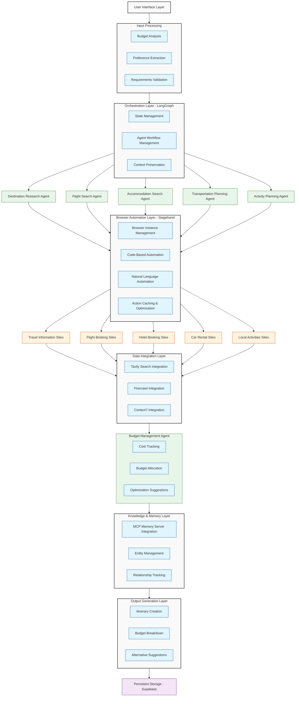
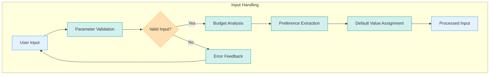
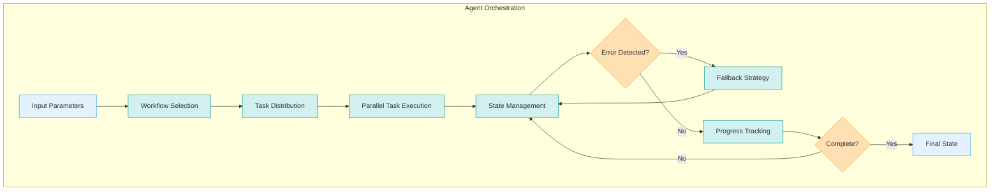
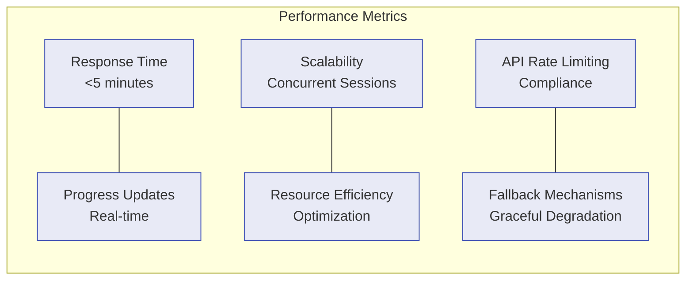
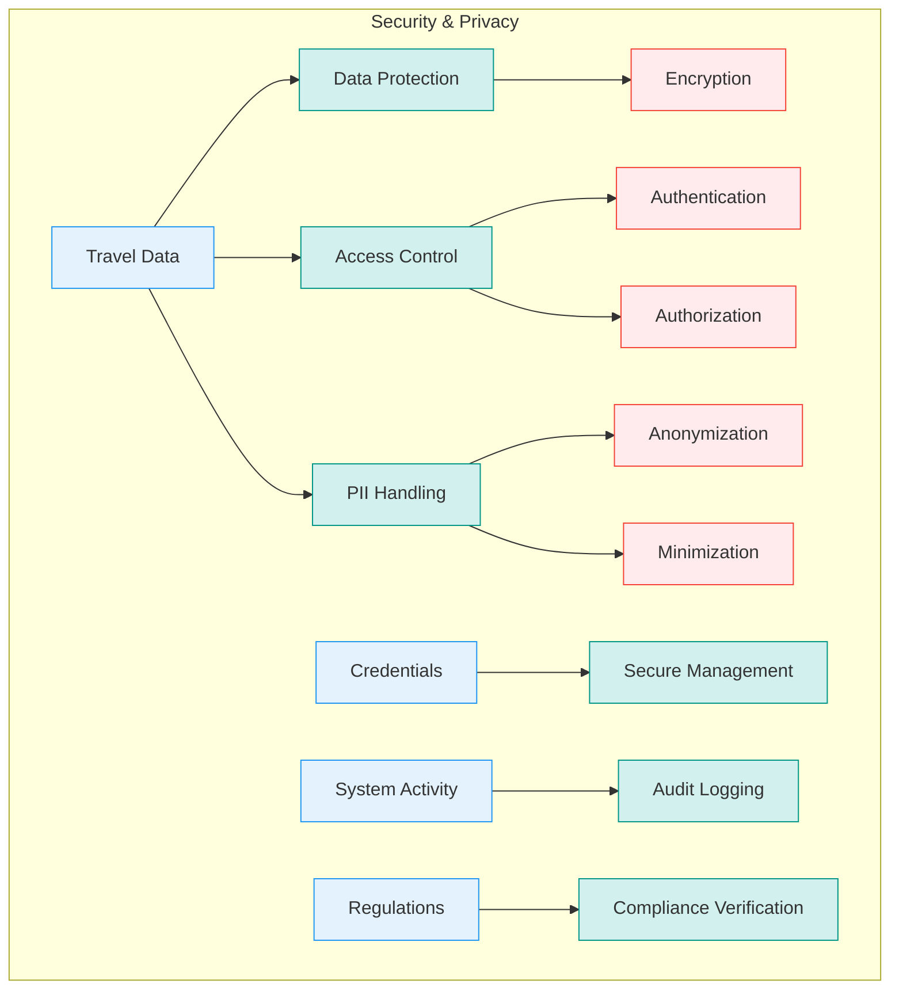
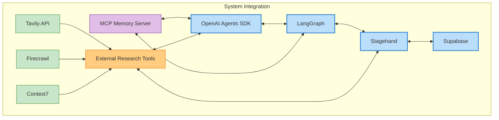
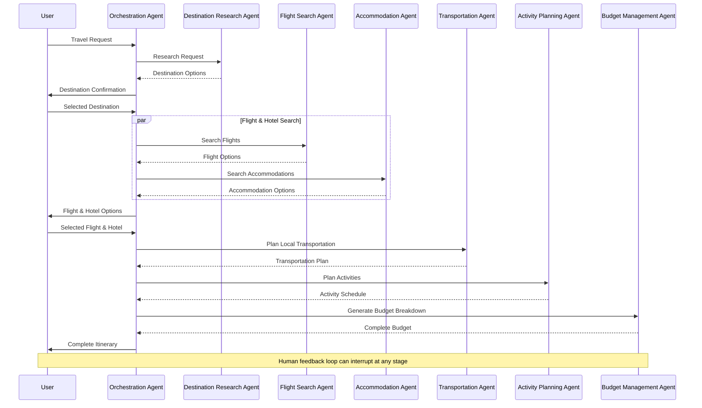

# AI Travel Planning System - Architecture & Requirements

## Definitive Technology Stack (May 2025)

After extensive research using various MCP server tools, I've determined the optimal technology stack for implementing our AI Travel Planning System:

### Core Components

1. **Primary Agent Framework**: OpenAI Agents SDK (Latest 2025 Release)

   - Advanced reasoning capabilities with sequential problem decomposition
   - Comprehensive tool use and integration features
   - Built-in tracking and monitoring
   - Support for handoffs between specialized agents

2. **Orchestration Layer**: LangGraph v0.4+ / LangChain

   - Graph-based agent workflow management
   - Support for parallel handoffs (new in 2025)
   - Advanced state management
   - Human-in-the-loop capabilities via interrupts

3. **Browser Automation**: Stagehand v2.0+ (Built on Playwright)

   - Hybrid approach combining code and natural language instructions
   - Self-healing automation resistant to UI changes
   - Integration with OpenAI and Anthropic computer use models
   - Action preview and caching for performance and cost optimization

4. **Data Persistence**: Supabase

   - Real-time database capabilities
   - Secure storage for user preferences and travel details
   - Scalable architecture

5. **Research Tools**:

   - Tavily for intelligent web search
   - Firecrawl for detailed web content extraction
   - Context7 for accessing documentation

6. **Memory & Knowledge Management**: Memory MCP Server
   - Persistent context across sessions
   - Knowledge graph for travel recommendations
   - Entity relationship tracking

## System Architecture Diagram

## Detailed Requirements

### 1. Input Handling Requirements

- **Parameter Validation**: Validate all input parameters for completeness and validity
- **Budget Analysis**: Parse and validate budget constraints, categorizing by travel components
- **Preference Extraction**: Extract explicit and implicit preferences from user input
- **Default Values**: Provide sensible defaults for optional parameters
- **Error Handling**: Provide clear feedback for invalid or incomplete inputs

### 2. Orchestration Requirements

- **Workflow Management**: Define and manage complex multi-agent workflows
- **State Management**: Maintain consistent state across agent handoffs
- **Parallel Processing**: Execute compatible tasks in parallel to reduce overall planning time
- **Error Recovery**: Implement fallback strategies for failed agent tasks
- **Progress Tracking**: Provide visibility into the planning process status
- **Human Intervention**: Support human-in-the-loop capabilities when needed

### 3. Research Agent Requirements

- **Destination Analysis**: Research and recommend destinations based on user preferences
- **Point of Interest Identification**: Identify key attractions and activities at potential destinations
- **Weather Analysis**: Incorporate seasonal weather patterns into recommendations
- **Travel Advisory Checking**: Check for any travel advisories or restrictions
- **Local Transportation Assessment**: Evaluate local transportation options
- **Cultural Information**: Provide relevant cultural information for suggested destinations

### 4. Flight Search Agent Requirements

- **Comprehensive Search**: Search multiple flight booking sites for optimal options
- **Filter Application**: Apply filters for airlines, times, stops, etc. based on preferences
- **Price Tracking**: Track prices over time if applicable
- **Alternative Suggestions**: Suggest nearby airports or date adjustments for better deals
- **Baggage Policy Analysis**: Include baggage allowance information in comparisons
- **Special Requirements Handling**: Account for special needs (accessibility, etc.)

### 5. Accommodation Agent Requirements

- **Lodging Type Matching**: Find accommodations matching preferred types (hotels, rentals, etc.)
- **Amenity Verification**: Confirm availability of required amenities
- **Location Analysis**: Analyze proximity to attractions and transportation
- **Review Analysis**: Incorporate review sentiment into recommendations
- **Price Comparison**: Compare prices across multiple booking platforms
- **Availability Confirmation**: Verify actual availability for specified dates

### 6. Transportation Agent Requirements

- **Transfer Planning**: Plan transfers between airports, accommodations, and activities
- **Rental Options**: Research car rental options when appropriate
- **Public Transit Analysis**: Evaluate public transportation options
- **Cost Optimization**: Balance convenience and cost
- **Special Requirements**: Account for special needs (child seats, accessibility, etc.)
- **Scheduling Coordination**: Ensure transportation timing aligns with overall itinerary

### 7. Activity Planning Agent Requirements

- **Interest Matching**: Match activities to user interests
- **Scheduling Optimization**: Create logical daily schedules considering opening hours, travel time
- **Booking Research**: Identify booking requirements and availability
- **Cost Tracking**: Track activity costs within overall budget
- **Alternative Suggestions**: Provide backup options for weather-dependent activities
- **Local Insights**: Incorporate local insights and off-the-beaten-path suggestions

### 8. Budget Management Agent Requirements

- **Allocation Strategy**: Develop optimal budget allocation across travel components
- **Cost Tracking**: Track estimated costs for all components
- **Comparison Analysis**: Compare options based on value, not just cost
- **Alternative Suggestions**: Suggest cost-saving alternatives when appropriate
- **Budget Visualization**: Provide clear budget breakdowns
- **Threshold Alerts**: Alert when budget thresholds are at risk of being exceeded

### 9. Browser Automation Requirements

- **Website Handling Flexibility**: Navigate both standardized and complex travel websites
- **Error Resilience**: Recover from unexpected UI changes or errors
- **Performance Optimization**: Implement caching to reduce redundant operations
- **Parallel Execution**: Support multiple simultaneous browser sessions
- **Data Extraction**: Extract structured data from diverse webpage formats
- **Action Verification**: Verify successful execution of browser actions

### 10. Data Storage Requirements

- **User Preference Persistence**: Store user preferences securely
- **Session Management**: Maintain session state for long-running operations
- **Itinerary Storage**: Store generated itineraries for future reference
- **Version Control**: Track changes to itineraries during refinement
- **Access Control**: Ensure appropriate access controls for sensitive information
- **Data Backup**: Implement reliable backup mechanisms

### 11. Output Generation Requirements

- **Comprehensive Itineraries**: Generate detailed day-by-day itineraries
- **Budget Breakdown**: Provide transparent cost breakdown by category
- **Booking Information**: Include all necessary booking information and links
- **Alternative Options**: Present alternative recommendations when appropriate
- **Visual Enhancement**: Include maps and visual aids when possible
- **Export Capability**: Support exporting itineraries in various formats

### 12. System Performance Requirements

- **Response Time**: Complete initial planning within 5 minutes
- **Progress Updates**: Provide real-time updates during extended searches
- **Scalability**: Support concurrent planning sessions
- **Resource Efficiency**: Optimize resource usage, particularly for browser automation
- **API Rate Limiting**: Respect rate limits for external services
- **Fallback Mechanisms**: Implement graceful degradation when services are unavailable

### 13. Security and Privacy Requirements

- **Data Protection**: Implement appropriate encryption for sensitive data
- **Access Control**: Limit access to authorized users only
- **PII Handling**: Properly handle personally identifiable information
- **Credential Management**: Securely manage any required credentials
- **Audit Logging**: Maintain logs of system activities
- **Compliance**: Ensure compliance with relevant regulations

### 14. Integration Requirements

- **MCP Tool Integration**: Seamlessly integrate with available MCP server tools
- **External API Connectivity**: Connect to necessary external APIs
- **Data Format Standardization**: Standardize data formats for consistency
- **Error Handling**: Implement robust error handling for integration points
- **Version Compatibility**: Ensure compatibility with dependent service versions
- **Monitoring**: Monitor integration health and performance

## Agent Interaction Flow

These detailed requirements provide a comprehensive foundation for developing our AI Travel Planning System with the selected technology stack. The system leverages the latest advancements in AI agent technologies while ensuring practical implementation and optimal user experience.
